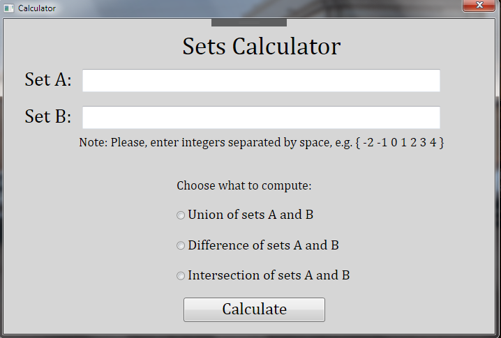

# Sets

Program demonstrating how to work with  class "set", allowing you to perform basic operations - adding and removing elements, intersection, union and difference of multiple, etc. 

Using Windows Presentation Foundation and C#

The program looks like this:

